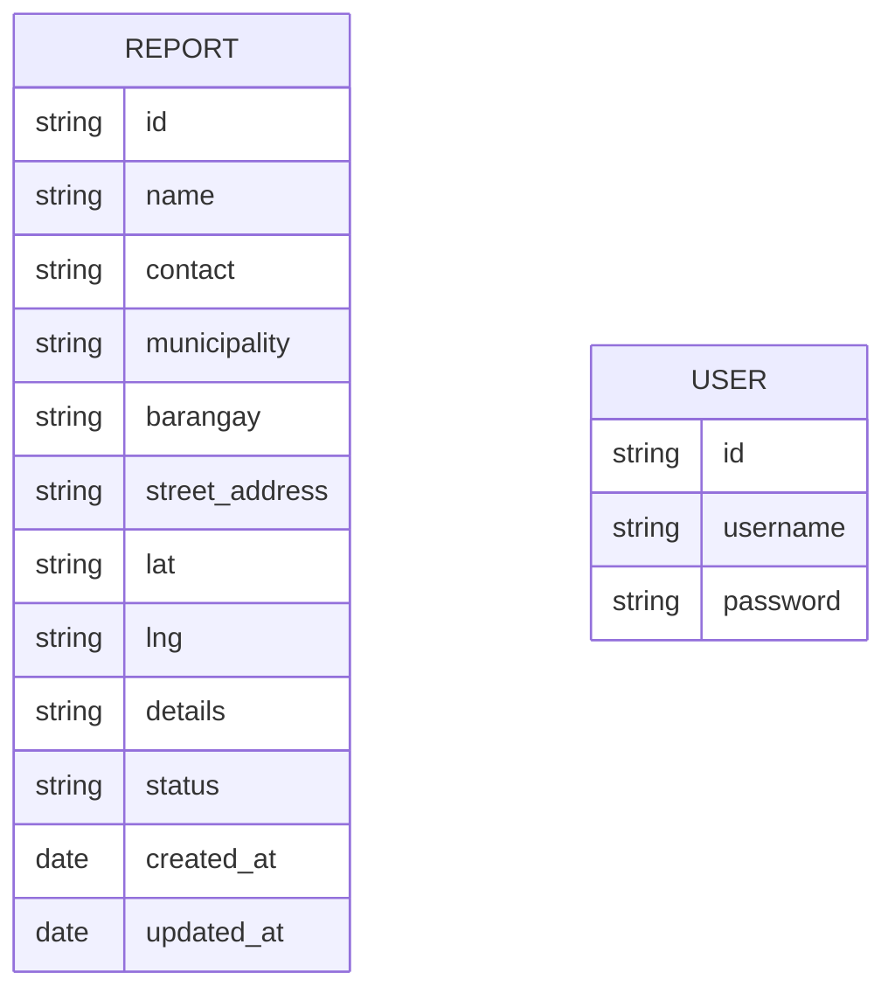

# report-app-backend

ExpressJS + Mongoose + Typescript + JWT

### Environments
1. test 
2. production

### ERD

```mermaid
erDiagram
    REPORT {
        string id
        string name
        string contact
        string municipality
        string barangay
        string street_address
        string lat
        string lng
        string details
        string status
        date created_at
        date updated_at
    }
    USER {
        string id
        string username
        string password
    }
```